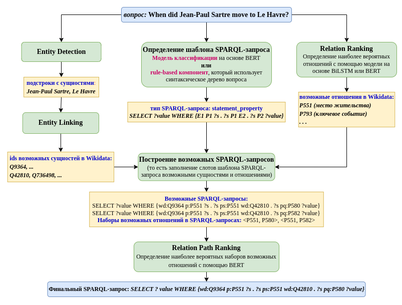
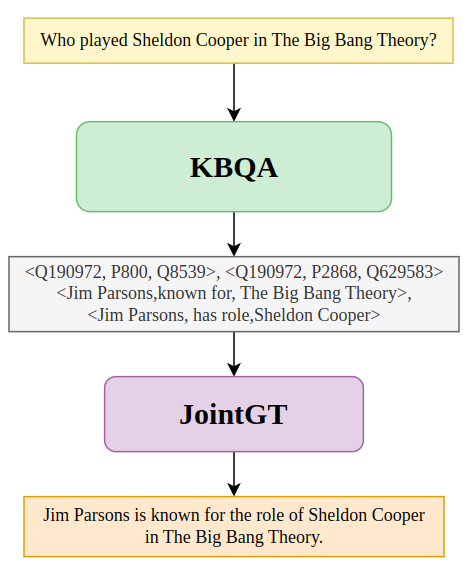
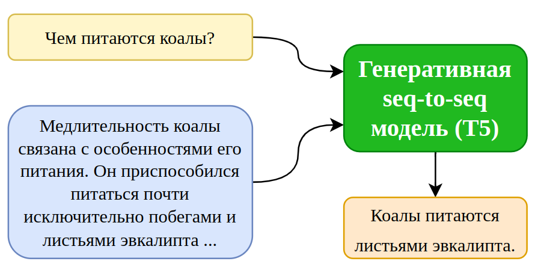
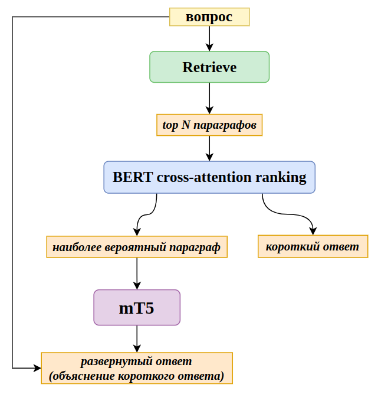

# Services for question answering over knowledge graphs and text and answer explanation

<!-- TOC -->

- [Navigation]
    - [Models description](#model description)
    - [Launching the services](#lauch services)
    - [Services parameters](#parameters)
    - [Mapping of volumes](#volumes)
    - [Models metrics](#metrics)
    - [Services usage](#usage)
        - [Russian ODQA](#text russian)
        - [Russian KDQA](#kbqa russian)
        - [English KDQA](#kbqa english)
        - [LLM based KDQA](#llms generation)

<!-- /TOC -->


<a name="model description">Models description</a>
------------------

KBQA is the system for question answering over knowledge graphs.

<p align="center">

</p>

The system outputs the answer and answer explanation (triplets which connect the entities from the question and the answer entities).

Generative model based on JointGT approach generates answer explanation in the form of text from the triplets.

<p align="center">

</p>
 
The text-based generative model (T5) takes as input the question, the paragraph with the answer and generates detailed answer.

<p align="center">

</p>

Question Answering system takes as input the question, finds top N relevant paragraphs, re-ranks them with BERT-based model and outputs the short answer and the detailed answer (explanation of the short answer).

<p align="center">

</p>


<a name="lauch services">Launching the services</a>
----------------------

Lauch the service for text-based question answering and answer explanation:

```shell
docker-compose up --build retrieve text-based-generation
```
    
Lauch the service which performs question answering over knowledge graphs and outputs the answer explanation (triplets, containing the entities from the question and the answer entities):

```shell
docker-compose up --build kbqa
```

Launch the service that generated verbalized answers to the questions or generates text from triplets:

```shell
docker-compose up --build graph-based-generation
```

Launch the LLM based service that generated verbalized answers to the questions or generates text from triplets:

```shell
docker-compose up --build llm-based-generation
```


<a name="parameters">Services parameters</a>
-------------------

To choose the language of KBQA, you should change the line 58 in docker-compose.yml file: RU for Russian, EN for English.


<a name="volumes">Mapping of volumes</a>
------------------

In docker-compose.yml the default mapping of the volume with model checkpoints and databases in the following:

 ~/.deeppavlov:/root/.deeppavlov

You can change this mapping to your custom:

 <your_custom_local_directory>:/root/.deeppavlov


<a name="metrics">Models metrics</a>
--------------

Accuracy of Russian version of KBQA on RuBQ2.0 dataset:

**acc = 53.1.**

Accuracy of finding explanations for answers:

**acc = 29.3.**

SacreBLEU of T5 model which generates answer explanation from question on DSberQuAD dataset:

**SacreBLEU = 64.7.**

BLEU scores of JointGT model which generates answer explanation from triplets on subset of LC-QUAD dataset:

BLEU-1 | BLEU-2
--- | ---
66.5 | 52.4


<a name="usage">Services usage</a>
--------------

### <a name="text russian">Generate detailed answer explanation from the question and paragraph:</a>

```python
import requests

res = requests.post("http://0.0.0.0:8006/generate",
                    json={"questions": ["Кто был первым человеком в космосе?"],
                          "paragraphs": [["12 апреля 1961 года Юрий Гагарин стал первым человеком в мировой истории, совершившим полёт в "
                                          "космическое пространство."]]}).json()
print(res)

res = requests.post("http://0.0.0.0:8006/generate",
                    json={"questions": ["Где живут кенгуру?"],
                          "paragraphs": [["Водятся кенгуру в Австралии, в Тасмании, на Новой Гвинее и на архипелаге Бисмарка. "
                                          "Завезены в Новую Зеландию. Большинство видов — наземные, обитают на равнинах, поросших густой "
                                          "высокой травой и кустарником."]]}).json()

res = requests.post("http://0.0.0.0:8006/generate",
                    json={"questions": ["Какое самое глубокое озеро в мире?"],
                          "paragraphs": [["Байкал — озеро тектонического происхождения в южной части Восточной Сибири, самое глубокое "
                                          "озеро на планете, крупнейший природный резервуар пресной воды и самое большое по площади "
                                          "пресноводное озеро на континенте."]]}).json()
```

#### The script with these examples can be found in ./text_based_generation/examples.py

Example of the output:
```json
    [{"long_explanation": "Байкал - это самое глубокое озеро в мире."}]
```

### Find the answer, the answer paragraph, and generate answer explanation:

```python
import requests

res = requests.post(
    "http://0.0.0.0:8006/ans_expl",
    json={"questions": ["Кто был первым человеком в космосе?"]}
).json()

print(res)

res = requests.post(
    "http://0.0.0.0:8006/ans_expl",
    json={"questions": ["Где живут кенгуру?"]}
).json()

res = requests.post(
    "http://0.0.0.0:8006/ans_expl",
    json={"questions": ["Какое самое глубокое озеро в мире?"]}
).json()
```

#### The script with these examples can be found in ./text_based_generation/examples.py

Example of the output:

```json
    [{
       "answer": "Байка́л",
       "answer_place": 0,
       "answer_score": 1.0,
       "long_explanation": "Байка́л - это самое глубокое озеро в мире."
     }
    ]
```

### Get metrics of text-based answer explanation model:

```python
import requests

res = requests.post("http://0.0.0.0:8006/get_metrics_expl", json={"num_samples": 100}).json()
print(res)
```

### Get metrics of text-based question answering and subsequent answer explanation model:

```python
import requests

res = requests.post("http://0.0.0.0:8006/get_metrics_ans_expl", json={"num_samples": 100}).json()
print(res)
```


### Answer the question over knowledge graph and get an explanation of the answer (triplets from the KG which connect the entities from the question and answer entities)

#### <a name="kbqa russian">Russian version of Knowledge Base Question Answering</a>

```python
import requests

res = requests.post(
    "http://0.0.0.0:8008/respond",
    json={"questions": ["Какой документ, подписанный 7 февраля 1992 года, положил начало Европейскому Союзу?"]}
).json()

print(res)

res = requests.post(
    "http://0.0.0.0:8008/respond",
    json={"questions": ["Какая столица России?"]}
).json()

res = requests.post(
    "http://0.0.0.0:8008/respond",
    json={"questions": ['Кто сыграл Бормана в народном телесериале "Семнадцать мгновений весны"?']}
).json()

res = requests.post(
    "http://0.0.0.0:8008/respond",
    json={"questions": ["Кто режиссер фильма Властелин колец: Две крепости?"]}
).json()

res = requests.post(
    "http://0.0.0.0:8008/respond",
    json={"questions": ['Какой футболист в 2004 году получил "Золотой мяч"?']}
).json()
```

#### <a name="kbqa english">English version of Knowledge Base Question Answering</a>

```python
import requests

res = requests.post(
    "http://0.0.0.0:8008/respond",
    json={"questions": ["Who directed Forrest Gump?"]}
).json()

print(res)

res = requests.post(
    "http://0.0.0.0:8008/respond",
    json={"questions": ["When did Jean-Paul Sartre move to Le Havre?"]}
).json()

res = requests.post(
    "http://0.0.0.0:8008/respond",
    json={"questions": ["What is the capital of Belarus?"]}
).json()

res = requests.post(
    "http://0.0.0.0:8008/respond",
    json={"questions": ["What team did Lionel Messi play for in 2004?"]}
).json()

res = requests.post(
    "http://0.0.0.0:8008/respond",
    json={"questions": ["Who is the painter of Mona Lisa?"]}
).json()

res = requests.post(
    "http://0.0.0.0:8008/respond",
    json={"questions": ["What position was held by Harry S. Truman on 1/3/1935?"]}
).json()

```

#### The scripts with these examples can be found in ./kbqa/examples_ru.py and ./kbqa/examples_en.py

Example of the output:

```json
    [
      {"answer": "Юрий Иосифович Визбор",
       "answer_ids": ["Q582152"],
       "confidence": 1.0,
       "entities_and_rels": [["Q472018", "Q76367"], ["P161", "P453"]],
       "sparql_query": "SELECT ?answer WHERE { wd:Q472018 p:P161 ?s . ?s ps:P161 ?answer . ?s ?p wd:Q76367. }",
       "triplets": [[["Семнадцать мгновений весны", "в ролях", "Юрий Иосифович Визбор"],
                     ["Юрий Иосифович Визбор", "играет роль персонажа", "Мартин Борман"]]]
      }
    ]
```

### Get metrics of knowledge base question answering and answer explanation (finding triplets which connect entities from answer with answers):

```python
import requests

res = requests.post("http://0.0.0.0:8008/get_metrics", json={"num_samples": 100}).json()
print(res)
```

### Generate sentence explaining the answer from Knowledge Base triplets:

```python
import requests

res = requests.post(
    "http://0.0.0.0:8007/generate",
    json={"triplets": [[["Belarus", "capital", "Minsk"]]]}
).json()

print(res)

res = requests.post(
    "http://0.0.0.0:8007/generate",
    json={"triplets": [[["Forrest Gump", "director", "Robert Zemeckis"]]]}
).json()

res = requests.post(
    "http://0.0.0.0:8007/generate",
    json={"triplets": [[["Jean-Paul Sartre", "residence", "Le Havre"],
                        ["Le Havre", "start time", "1931"]]]}
).json()

res = requests.post(
    "http://0.0.0.0:8007/generate",
    json={"triplets": [[["Lionel Messi", "member of sports team", "FC Barcelona"],
                        ["FC Barcelona", "start time", "2004"]]]}
).json()

res = requests.post(
    "http://0.0.0.0:8007/generate",
    json={"triplets": [[["Mona Lisa", "creator", "Leonardo da Vinci"]]]}
).json()

res = requests.post(
    "http://0.0.0.0:8007/generate",
    json={"triplets": [[["Harry S. Truman", "position held", "United States senator"],
                        ["United States senator", "start time", "1935"]]]}
).json()

```

### Answer the question over the knowledge graph and generate sentence explaining the answer:


```python
import requests

res = requests.post(
    "http://0.0.0.0:8007/ans_expl",
    json={"questions": ["Who directed Forrest Gump?"]}
).json()

print(res)

res = requests.post(
    "http://0.0.0.0:8007/ans_expl",
    json={"questions": ["When did Jean-Paul Sartre move to Le Havre?"]}
).json()

res = requests.post(
    "http://0.0.0.0:8007/ans_expl",
    json={"questions": ["What is the capital of Belarus?"]}
).json()

res = requests.post(
    "http://0.0.0.0:8007/ans_expl",
    json={"questions": ["What team did Lionel Messi play for in 2004?"]}
).json()

res = requests.post(
    "http://0.0.0.0:8007/ans_expl",
    json={"questions": ["Who is the painter of Mona Lisa?"]}
).json()

res = requests.post(
    "http://0.0.0.0:8007/ans_expl",
    json={"questions": ["What position was held by Harry S. Truman on 1/3/1935?"]}
).json()

```

### Get metrics of the model, which generates answer explanation from triplets:

```python
import requests

res = requests.post("http://0.0.0.0:8007/get_metrics", json={"num_samples": 100}).json()
print(res)
```


### <a name="llms generation">Generate sentence explaining the answer with LLMs:</a>

Currently, the following LLMs were evaluated on the task. Depending on your computational resources, you might want to load a quantized model or not. To choose the specific version of the LLM you want and tweak the parameters, go the the docker-compose.yaml file. Generation parameters are in the /llm_based_generation/generation_params.json file.

* [Vicuna 13B](https://huggingface.co/lmsys/vicuna-13b-v1.3)
* [OpenAssistant's Pythia](https://huggingface.co/OpenAssistant/pythia-12b-sft-v8-7k-steps)
* [Bloomz 7B](https://huggingface.co/bigscience/bloomz-7b1)
* [GPT-J](https://huggingface.co/EleutherAI/gpt-j-6B)


The approximate hardware resources required to use the models are as follows:

| Model Parameters | GPU RAM        | CPU RAM | DISK   | Generate time |
| ---------------- | -------------- | ------- | ------ | ------------- |
| Vicuna           | 8.4GB          | X.XGB   | XX.XGB | ~14-15s       |
| Pythia           | 8.4GB          | X.XGB   | XX.XGB | ~20s          |  
| BLOOMZ           | 8.4GB          | X.XGB   | XX.XGB | ~5-6s         |
| GPT-J            | 8.4GB          | X.XGB   | XX.XGB | ~6s           |


Generating verbalized answer from graphs using LLMs is the same as when using fine-tune JointGT model. Just change the port to 8009. 

```python
import requests

res = requests.post(
    "http://0.0.0.0:8009/generate",
    json={"triplets": [[["Jean-Paul Sartre", "residence", "Le Havre"],
                        ["Le Havre", "start time", "1931"]]]}
).json()

res = requests.post(
    "http://0.0.0.0:8009/ans_expl",
    json={"questions": ["What position was held by Harry S. Truman on 1/3/1935?"]}
).json()

res = requests.post("http://0.0.0.0:8009/get_metrics", json={"num_samples": 100}).json()

```
